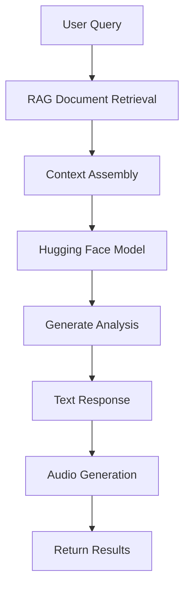

# 📊 FinanceGuru - AI-Powered Financial Analysis Platform

FinanceGuru is a cutting-edge financial analysis platform that combines Hugging Face Transformers, RAG (Retrieval-Augmented Generation), and advanced temporal document processing to provide intelligent financial insights. Upload your bank statements, credit card bills, and financial documents to receive comprehensive AI-powered analysis with both text and audio summaries.

## Table of Contents

- [Overview](#overview)
- [Key Features](#key-features)
- [AI & Technology Stack](#ai--technology-stack)
- [Architecture](#architecture)
- [Prerequisites](#prerequisites)
- [Getting Started](#getting-started)
  - [Backend Setup](#backend-setup)
  - [Frontend Setup](#frontend-setup)
  - [Running with Docker Compose](#running-with-docker-compose)
- [API Endpoints](#api-endpoints)
- [Temporal Analysis & RAG System](#temporal-analysis--rag-system)
- [How FinanceGuru Works](#how-financeguru-works)
- [Contributing](#contributing)
- [License](#license)

## Overview

FinanceGuru revolutionizes personal finance management through AI-powered document analysis. Instead of manually reviewing financial statements, simply upload your documents and receive intelligent, context-aware analysis that remembers your financial history and provides temporal comparisons like "Your April spending vs May spending."

**🎯 Perfect for:** Personal finance tracking, budget analysis, spending pattern identification, financial trend monitoring, and accessible financial insights through audio summaries.

## Key Features

### 🤖 **Advanced AI Integration**
- **Hugging Face Transformers**: Microsoft Phi-2 and BlenderBot models for natural language generation
- **Fallback System**: Automatic model switching for reliability
- **4-bit Quantization**: Memory-efficient model loading with CUDA acceleration
- **Natural Speech**: Human-like financial analysis responses

### 📚 **RAG (Retrieval-Augmented Generation) System**
- **ChromaDB Vector Database**: Semantic search across all your financial documents
- **Smart Document Memory**: Contextual analysis using historical financial data
- **Cross-Document Intelligence**: Pattern recognition across multiple statements
- **Metadata-Rich Storage**: Temporal and document metadata for enhanced retrieval

### ⏰ **Temporal Analysis Engine**
- **Smart Date Recognition**: Automatically extracts dates from any format (MM/DD/YYYY, "January 15, 2025", etc.)
- **Month-to-Month Comparison**: "Your April vs May spending increased by 15%"
- **Historical Trends**: Analysis based on document chronology and patterns
- **Statement Period Detection**: Identifies billing cycles and financial periods

### 📄 **Intelligent Document Processing**
- **Multi-Format Support**: PDF, DOC, DOCX, TXT, CSV, JSON, XML, HTML
- **Unstructured Library**: Robust parsing of complex financial documents
- **Automatic Text Extraction**: Clean extraction from bank statements and bills
- **Secure Processing**: Temporary file handling with automatic cleanup

### 🔊 **Text-to-Speech Integration**
- **Google TTS**: Converts analysis to natural-sounding audio
- **Comprehensive Audio**: Full financial rundown including all statements
- **Single Output**: Always generates `latest_financial_analysis.mp3`
- **Accessibility**: Perfect for visually impaired users or hands-free listening

### 💾 **Robust Data Management**
- **SQLite Databases**: Interaction history and RAG document storage
- **Vector Embeddings**: Semantic similarity search capabilities
- **Metadata Flattening**: ChromaDB-compatible temporal data storage
- **Transaction Safety**: Error recovery and database integrity

## AI & Technology Stack

### **AI Models**
- **Primary**: `microsoft/phi-2` (2.7B parameters) - Advanced reasoning and financial analysis
- **Fallback**: `facebook/blenderbot-400M-distill` - Conversational AI backup
- **Embeddings**: `sentence-transformers/all-mpnet-base-v2` - Semantic document search

### **Core Technologies**
- **Backend**: FastAPI (Python) with async processing
- **Frontend**: Vue.js 3 with modern UI components  
- **Vector Database**: ChromaDB for semantic document storage
- **Document Processing**: Unstructured.io for robust parsing
- **AI Framework**: Hugging Face Transformers with PyTorch
- **Audio**: Google Text-to-Speech (gTTS)

### **Data Processing**
- **Date Extraction**: Advanced regex patterns with `dateutil` parsing
- **Text Chunking**: Intelligent document segmentation for RAG
- **Metadata Extraction**: Financial document structure recognition
- **Temporal Analysis**: Cross-document pattern recognition

## Architecture

FinanceGuru features a modern microservices architecture designed for scalability and maintainability:

```
┌─────────────────┐    ┌──────────────────┐    ┌─────────────────┐
│   Vue.js SPA    │    │   FastAPI        │    │  ChromaDB       │
│   Frontend      │◄──►│   Backend        │◄──►│  Vector Store   │
└─────────────────┘    └──────────────────┘    └─────────────────┘
                                │
                       ┌────────▼────────┐
                       │  Hugging Face   │
                       │  Transformers   │
                       └─────────────────┘
```

### **Backend Services**
- **`document_parser.py`**: Multi-format document processing with temporal extraction
- **`hf_llm_service.py`**: Hugging Face model integration with advanced prompt engineering
- **`rag_service.py`**: ChromaDB vector operations and semantic search
- **`tts_service.py`**: Audio generation and file management
- **`llm_service.py`**: High-level AI orchestration and response coordination

### **Database Architecture**
- **`llm_interactions.sqlite`**: User interactions, analysis history, and system logs
- **`rag_documents.sqlite`**: Document metadata and chunking information
- **`chroma.sqlite3`**: Vector embeddings and semantic search indices

## Prerequisites

Before you begin, ensure you have the following installed:

*   **[Docker](https://www.docker.com/get-started)** and **[Docker Compose](https://docs.docker.com/compose/install/)** (recommended)
*   **[Python 3.8+](https://www.python.org/downloads/)** with pip
*   **[Node.js 16+](https://nodejs.org/)** and npm/yarn
*   **GPU Support** (optional): CUDA-compatible GPU for faster AI inference
*   **Minimum RAM**: 8GB (16GB recommended for optimal performance)

## Getting Started

1.  **Clone the repository:**
    ```bash
    git clone <your-repository-url>
    cd FinanceGuru
    ```

### Backend Setup (Manual)

1.  **Navigate to the backend directory:**
    ```bash
    cd backend
    ```
2.  **Create and activate a virtual environment:**
    ```bash
    python -m venv venv
    source venv/bin/activate  # On Windows use `venv\Scripts\activate`
    ```
3.  **Install dependencies:**
    ```bash
    pip install -r requirements.txt
    ```
4.  **Configure environment variables:**
    Create a `.env` file in the `backend` directory with necessary configurations:
    ```env
    # AI Model Configuration
    HF_MODEL_NAME=microsoft/phi-2
    HF_FALLBACK_MODEL=facebook/blenderbot-400M-distill
    
    # RAG Configuration  
    EMBEDDING_MODEL=sentence-transformers/all-mpnet-base-v2
    CHUNK_SIZE=1000
    CHUNK_OVERLAP=200
    
    # Database paths
    DATABASE_URL=sqlite:///./llm_interactions.sqlite
    RAG_DATABASE_URL=sqlite:///./rag_documents.sqlite
    CHROMA_DB_PATH=./chroma_db
    
    # Optional: GPU acceleration
    USE_CUDA=true
    ```
5.  **Initialize databases:**
    ```bash
    python -c "from app.services.rag_service import rag_service; rag_service.initialize_database()"
    ```
6.  **Run the backend server:**
    ```bash
    uvicorn app.main:app --reload --host 0.0.0.0 --port 8000
    ```

### Frontend Setup (Manual)

1.  **Navigate to the frontend directory:**
    ```bash
    cd ../frontend  # Or from the root: cd frontend
    ```
2.  **Install dependencies:**
    ```bash
    npm install
    ```
3.  **Run the frontend development server:**
    ```bash
    npm run dev
    ```
    The application should now be accessible at `http://localhost:5173` (or the port specified by Vite).

### Running with Docker Compose

This is the recommended way to run the application for ease of setup.

1.  **From the root of the project, build and start the services:**
    ```bash
    docker-compose up --build
    ```
2.  **Access the application:**
    - **Frontend**: http://localhost:5173
    - **Backend API**: http://localhost:8000
    - **API Documentation**: http://localhost:8000/docs

The Docker setup automatically handles:
- Database initialization
- Model downloading and caching
- Environment configuration
- Service orchestration

## API Endpoints

### **Document Management**
```bash
# Upload financial documents
POST /api/v1/upload-statement
Content-Type: multipart/form-data

# List stored documents  
GET /api/v1/rag/documents

# Delete specific document
DELETE /api/v1/rag/documents/{document_id}

# Search documents semantically
POST /api/v1/rag/search
{
  "query": "restaurant expenses in April",
  "limit": 5
}
```

### **Financial Analysis**
```bash
# Comprehensive AI analysis
POST /api/v1/analyze-data
{
  "prompt": "Compare my April vs May spending",
  "use_rag": true,
  "use_hf": true
}

# Returns:
# - Detailed text analysis
# - Historical comparisons  
# - Audio file path (MP3)
# - Actionable suggestions
```

### **System Health**
```bash
# API health check
GET /health

# Interactive documentation
GET /docs
```

## Temporal Analysis & RAG System

### **Smart Date Recognition**
FinanceGuru automatically extracts and understands dates from your financial documents:

```python
# Supported date formats:
"Statement Date: April 15, 2025"
"04/15/2025" 
"2025-04-15"
"Period: April 1 - April 30, 2025"
"Billing Cycle: 04/01/25 - 04/30/25"
```

### **Flattened Metadata Storage**
Documents are stored with rich temporal metadata compatible with ChromaDB:

```json
{
  "filename": "april_statement.pdf",
  "statement_date": "2025-04-15T00:00:00",
  "month_year": "April 2025", 
  "statement_period": "April 2025",
  "extracted_dates_count": 3,
  "date_0_raw": "04/15/25",
  "date_0_parsed": "2025-04-15T00:00:00",
  "date_0_month": 4,
  "date_0_year": 2025,
  "date_0_month_name": "April"
}
```

### **Contextual Analysis Examples**
- **"How did my spending change from April to May?"**
- **"What categories increased the most this month?"**
- **"Show me my restaurant expenses over the last 3 months"**
- **"Compare my current month to the same period last year"**

## How FinanceGuru Works

### **1. Document Processing Pipeline**


### **2. AI Analysis Workflow**


### **3. Temporal Intelligence**
FinanceGuru's temporal analysis engine provides:

- **Automatic Date Recognition**: Extracts dates from any document format
- **Historical Context**: "Based on your previous 3 months of statements..."
- **Trend Analysis**: "Your dining expenses have increased 20% since March"
- **Comparative Insights**: "This month's spending is 5% below your average"

### **4. Memory & Context**
The RAG system ensures FinanceGuru remembers your financial history:

- **Cross-Document Analysis**: Compares data across multiple statements
- **Semantic Search**: Finds relevant information even with different wording
- **Pattern Recognition**: Identifies recurring expenses and trends
- **Contextual Responses**: Uses historical data to provide richer insights

### **5. Audio Accessibility**
Every analysis includes comprehensive audio summaries:

- **Full Financial Rundown**: Complete overview of all statements
- **Natural Speech**: Human-like delivery of financial insights
- **Accessibility Support**: Perfect for visually impaired users
- **Hands-Free Operation**: Listen while commuting or multitasking

### **Example Analysis Output**
```json
{
  "analysis": "Your May 2025 spending increased by $234 compared to April...",
  "summary": "Higher restaurant and entertainment expenses drove the increase...",
  "suggestions": ["Consider setting a dining budget", "Track entertainment expenses"],
  "audio_file": "latest_financial_analysis.mp3",
  "temporal_context": {
    "current_month": "May 2025",
    "comparison_months": ["April 2025", "March 2025"],
    "trends": ["Dining up 15%", "Gas down 8%"]
  }
}
```

## Contributing

We welcome contributions to FinanceGuru! Here's how you can help:

### **Areas for Contribution**
- **AI Model Integration**: Add support for new Hugging Face models
- **Document Parsing**: Enhance support for additional financial document formats
- **Temporal Analysis**: Improve date recognition and pattern analysis
- **Frontend Features**: UI/UX improvements and new visualization components
- **Performance**: Optimization of model inference and database operations

### **Development Setup**
1. Fork the repository
2. Create a feature branch (`git checkout -b feature/amazing-feature`)
3. Make your changes
4. Add tests for new functionality
5. Commit your changes (`git commit -m 'Add amazing feature'`)
6. Push to the branch (`git push origin feature/amazing-feature`)
7. Open a Pull Request

### **Code Standards**
- Follow PEP 8 for Python code
- Use ESLint configuration for JavaScript/Vue.js
- Include docstrings for all functions and classes
- Add type hints for Python functions
- Write comprehensive tests for new features

## License

This project is licensed under the MIT License - see the [LICENSE](LICENSE) file for details.

## Acknowledgments

- **Hugging Face** for transformer models and tokenizers
- **ChromaDB** for vector database capabilities
- **Unstructured.io** for robust document parsing
- **FastAPI** for the high-performance backend framework
- **Vue.js** for the reactive frontend framework

---

**🚀 Ready to transform your financial document analysis? Get started with FinanceGuru today!**

*For support or questions, please open an issue on GitHub or contact the development team.*

